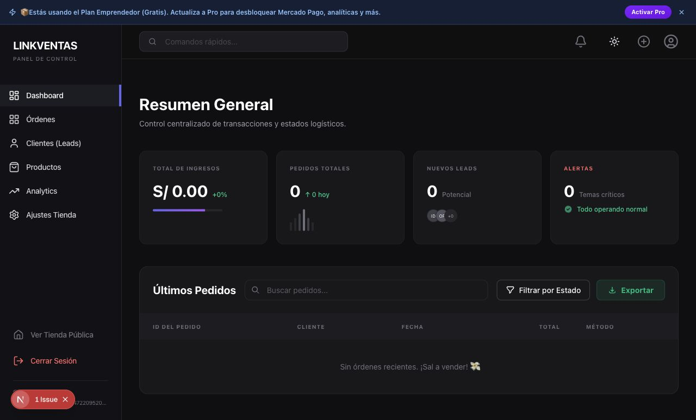

# Auditoría UX integral del dashboard de LinkVentas

> Estado posterior (31 de julio de 2026): se implementaron y verificaron los hallazgos críticos, los bugs funcionales y las brechas operativas prioritarias de esta auditoría. El documento conserva la evidencia original para trazabilidad; consulta `CHANGELOG.md` para el resumen de correcciones.

Fecha: 30 de julio de 2026
Alcance: Resumen, Pedidos, Productos/Catálogo, Clientes/Leads, Analíticas, Configuración, Plan Pro y controles globales.
Método: merchant nuevo, tienda de prueba, navegación real en `localhost`, cambios controlados entre `comercio`, `restaurante` y `moda`, producto de prueba y contraste con el código fuente.

## Conclusión ejecutiva

El dashboard tiene una base visual consistente y varias funciones reales, pero todavía mezcla una interfaz de producto terminado con controles decorativos, lenguaje interno y flujos que no respetan la plantilla activa.

La adaptación por plantilla **sí existe en Catálogo y parcialmente en Configuración**, pero no alcanza a la operación completa:

- Restaurante recibe tarifa de delivery, horarios, tiempo de preparación y modificadores.
- Moda recibe tallas, colores y una imagen por color en el formulario de producto.
- Comercio usa el formulario genérico.
- Configuración sigue siendo mayormente común para las tres.
- Pedidos no se adapta: una tienda Moda abre en “Delivery” con un mensaje dirigido a restaurantes.

Antes de ampliar Configuración o Catálogo, conviene corregir las señales falsas y los bloqueos operativos. El producto promete datos reales, pero Resumen todavía contiene un gráfico fijo, alertas fijas, avatares ficticios, dos buscadores falsos y un filtro sin acción.

## Evidencia y condiciones de prueba

- Cuenta creada: merchant de auditoría nuevo.
- Tienda: `Nueva tienda`, slug `store-153a6c6b`.
- Plantillas comparadas sobre la misma tienda: Comercio, Restaurante y Moda.
- Producto creado: `Blazer Aurora UX`, usado para probar la búsqueda real de Productos.
- Plantilla dejada al final de la prueba: **Moda**.
- No se eliminaron datos, no se enviaron mensajes por WhatsApp, no se procesaron pagos ni se subieron archivos.
- El entorno local no tiene `NEXT_PUBLIC_MP_PUBLIC_KEY`; por eso el botón de pago Pro aparece deshabilitado. El estado de producción queda **DESCONOCIDO**.

## Hallazgos críticos

### C1. Pedidos ignora la plantilla activa

`app/dashboard/pedidos/page.tsx` inicia siempre con `activeTab = 'delivery'`. En una tienda Moda, la primera vista fue “Delivery 0” y el vacío decía “Los pedidos del restaurante aparecerán aquí”.

Impacto: un merchant de Comercio o Moda aterriza en una operación ajena a su negocio y puede concluir que sus pedidos no existen.

Recomendación:

- Restaurante: abrir Delivery y ocultar “Standard / Legacy”.
- Comercio/Moda: abrir Pedidos y ocultar terminología legacy.
- Mostrar “Rescates” como módulo secundario, no como tipo de pedido.

### C2. El upsell Pro conduce a una acción deshabilitada sin explicación

El banner, Analíticas y Ajustes invitan a activar Pro. En `/pendiente`, “Pagar Plan Pro — S/ 25/mes” está deshabilitado cuando falta `NEXT_PUBLIC_MP_PUBLIC_KEY`, pero la pantalla no explica por qué ni ofrece alternativa.

Impacto: callejón sin salida en el principal flujo de monetización.

Recomendación: estado explícito de indisponibilidad, soporte/contacto y telemetría. Verificar producción antes de tratarlo como fallo global.

### C3. Resumen presenta señales ficticias como si fueran operativas

Confirmado en `app/dashboard/page.tsx`:

- El minigráfico de Pedidos usa seis barras con alturas fijas.
- Alertas muestra siempre `0` y “Todo operando normal”.
- Los avatares `ID`, `OF` y `+0` no representan leads reales.
- “Buscar pedidos…” no tiene estado ni `onChange`.
- “Filtrar por Estado” no tiene `onClick`.
- El buscador superior “Comandos rápidos…” está comentado en código como “falso / decorativo”.

Impacto: erosiona la confianza. Un `0` real y un `0` inventado se ven iguales.

Recomendación inmediata: eliminar los elementos falsos hasta que haya una fuente de datos real. No usar decoración con semántica de operación.

## Bugs funcionales confirmados

| Sección | Resultado |
|---|---|
| Resumen · Buscar pedidos | **No funciona.** Escribe texto, pero no filtra ni cambia el contenido. |
| Resumen · Filtrar por Estado | **No funciona.** El clic no cambia ningún estado ni abre controles. |
| Resumen · Exportar vacío | Tiene handler, pero si no hay órdenes retorna en silencio; debería explicar “No hay pedidos para exportar”. |
| Cabecera · Comandos rápidos | **No funciona.** Input decorativo sin lógica. |
| Pedidos · búsqueda | **No existe**, aunque es necesaria para localizar órdenes por ID, cliente o teléfono. |
| Pedidos · pestañas | Funcionan. Delivery, Standard/Legacy y Rescates cambian la vista. |
| Pedidos · Actualizar | Funciona y recarga los datos. |
| Productos · búsqueda | **Funciona con datos reales.** `Aurora` devolvió el producto; un término inexistente mostró el vacío. |
| Productos · Importar | Funciona: abre el modal y ofrece plantilla CSV. |
| Clientes/Leads · búsqueda | Funciona; el código filtra nombre, email y teléfono. |
| Clientes/Leads · filtro/orden | Están conectados. El dataset vacío no permitió validar resultados múltiples. |
| Analíticas · datos | Las métricas y gráficos derivan de órdenes/leads; no son valores fijos. |
| Plan Pro · pagar | Deshabilitado sin explicación en el entorno auditado. |
| Tema claro/oscuro | Funciona; la clase global cambió entre `dark` y `light`. |

Acciones no ejecutadas deliberadamente: destruir productos, eliminar leads, cancelar pedidos, enviar WhatsApp, cargar archivos y procesar pagos.

## Decisiones de diseño a mejorar

### Resumen

- La jerarquía visual es limpia, pero prioriza cuatro KPI equivalentes cuando lo más urgente debería ser “Pedidos por atender”.
- “Total de ingresos” no aclara periodo.
- El identificador mostrado usa `(legacy_id || id).split('-')[0]`; varios pedidos `BARR-...` terminarían visibles como `#BARR`, perdiendo unicidad.
- El método reduce todo a “Efectivo” o “Con QR”, lo que puede etiquetar Mercado Pago incorrectamente.

Propuesta: primera franja con “Por atender”, “En preparación”, “Incidencias reales” e “Ingresos del periodo”; debajo, actividad reciente con búsqueda funcional.

### Pedidos

- “Central Logística”, “Standard / Legacy” y “actividad fantasma” son lenguaje interno, no lenguaje merchant.
- La pantalla separa pedidos por origen técnico en vez de por trabajo: Nuevos, En preparación, En camino, Completados/Cancelados.
- Falta búsqueda y filtro global.

Propuesta: una sola bandeja de Pedidos, filtros por estado/tipo y vistas adaptadas a cada plantilla.

### Productos

- La búsqueda es real y rápida.
- “Bodega General”, “Bodega Maestra”, “SKU” y “Estado (Vitrina)” elevan la carga cognitiva para comercios pequeños.
- La categoría fallback de Comercio es `Ropa`, `Zapatos`, `Accesorios`, claramente heredada de Moda.
- Un producto Moda puede guardarse sin tallas ni colores, aunque la plantilla promete variantes obligatorias.
- El stock base se replica en cada combinación de variante; puede inflar el inventario lógico si el merchant interpreta el stock como total.

Propuesta: usar “Productos”, “Visible/Oculto” y “Stock”; exigir o guiar la matriz de variantes en Moda.

### Clientes/Leads

La navegación ya dice “Clientes (Leads)” y la página “Clientes & Leads”, pero la fuente es exclusivamente `store_leads`. El nombre sigue mezclando dos conceptos distintos.

### Analíticas

- El paywall comunica bien el valor, pero deja contenido interactivo detrás del overlay y expuesto en el árbol de accesibilidad.
- La conversión usa `ordersFiltradas.length / leads.length`: mezcla un numerador por periodo con un denominador de todos los tiempos y puede superar 100%.
- “Top clientes” agrupa solo por nombre, por lo que dos compradores homónimos se fusionan.
- Recharts emitió avisos de contenedores con ancho/alto `-1`.

### Accesibilidad y estabilidad

- Campana, acceso rápido a crear producto y perfil son iconos sin nombre accesible.
- Varios campos del alta de producto no están asociados programáticamente a su `<label>`.
- Se reprodujo repetidamente un mismatch de hidratación en la clase de tema de `<html>`.
- El dashboard mostró el badge de error de Next en desarrollo; no debe confundirse con UI de producto en las capturas.

## Recomendación Clientes vs Leads

Recomiendo **B: convertir “Clientes” en compradores reales derivados de `orders`, agrupados por teléfono/email**.

Razón de negocio: el merchant necesita responder preguntas de valor —quién compró, cuánto gastó, cuántas veces volvió y cuándo fue su última compra—. Eso genera retención, remarketing y soporte postventa. Un lead no equivale a un cliente y mezclar ambos contamina métricas como conversión y recurrencia.

Los leads pueden conservarse posteriormente como una vista secundaria llamada “Oportunidades” o “Carritos por recuperar”, pero no deberían ocupar el concepto principal de Clientes.

Tamaño estimado: mediano. Ya existen `customer_name`, `customer_phone` y `customer_email` en `orders`; hace falta normalización de identidad, agregación y una estrategia para datos incompletos.

## Brecha de Configuración por plantilla

| Plantilla | Qué muestra hoy | Qué debería mostrar | Brecha | Tamaño |
|---|---|---|---|---|
| Restaurante | Configuración común; WhatsApp; ubicación/mapa; tarifa base; horario que bloquea checkout; diseño, redes y contenido genérico. | Delivery activo/inactivo, zonas/radio, tarifa por zona, pedido mínimo, pickup, tiempo de preparación por defecto, anticipación/cierre, categorías de menú y política de modificadores. | Adaptación parcial. Solo la tarifa diferencia claramente esta pantalla. | Grande |
| Comercio | Configuración común; QR Yape/Plin; ubicación/mapa; horario; WhatsApp, redes, FOMO y contenido. | Métodos y costos de envío, cobertura, pickup, transportista, tiempo de despacho, categorías, política de stock y variantes opcionales según rubro. | Ubicación y horario se imponen aunque una tienda online pueda aceptar pedidos 24/7. No hay modelo de envíos. | Grande |
| Moda | Prácticamente lo mismo que Comercio. | Tabla/guía de tallas, política de cambios y devoluciones, convenciones de talla, defaults de color/talla, pickup/envíos y galería por color. | No existe ninguna configuración de negocio propia de Moda. | Grande |

### Campos irrelevantes o mal ubicados

- Restaurante: “Ofrecer envío gratis” y “Entrega inmediata” viven por producto con lenguaje de ecommerce genérico; deberían integrarse al modelo de delivery/preparación.
- Comercio: presets `Ropa/Zapatos/Accesorios` no corresponden a comercio general.
- Moda: ubicación física y horario pueden ser opcionales; falta lo esencial de postventa y tallaje.
- Todas: marketing, diseño y contenido son razonablemente compartibles; logística no debería ser idéntica.

## Brecha de Catálogo por plantilla

| Plantilla | Qué muestra hoy | Qué debería mostrar | Brecha | Tamaño |
|---|---|---|---|---|
| Restaurante | Base genérica + categorías de menú, tiempo de preparación, disponibilidad y constructor de adicionales/modificadores. También muestra envío gratis y entrega inmediata. | Mantener modificadores, disponibilidad y preparación; añadir alérgenos/ingredientes opcionales, porción/tamaño, reglas claras de obligatorios y ocultar campos de shipping que no aplican. | Es la adaptación más avanzada, pero comparte campos contradictorios del formulario base. | Mediano |
| Comercio | Formulario base, stock, precio, galería, envío gratis y entrega inmediata. Presets de categoría de Moda. | Categorías configurables, SKU/código de barras, peso/dimensiones si afectan envío, variantes opcionales y stock por variante. | Funcional como mínimo viable, pero no realmente “general”. | Mediano |
| Moda | Base + tallas separadas por comas, colores y carga de imagen por color. Genera combinaciones relacionales. | Matriz talla × color con stock/SKU/precio por combinación, validación obligatoria, guía de tallas vinculada y galería consistente por color. | Existe la base técnica, pero la UX de variantes es demasiado débil y opcional. | Grande |

No se implementó ningún rediseño de Configuración o Catálogo.

## Reacomodo recomendado

1. **Inicio**: pedidos por atender, incidencias reales, ingresos del periodo y actividad reciente.
2. **Pedidos**: una bandeja adaptada a la plantilla; rescates como vista secundaria.
3. **Productos**: catálogo, visibilidad y stock en lenguaje simple.
4. **Clientes**: compradores reales; “Oportunidades” separado.
5. **Analíticas**: Pro, con métricas de periodo consistentes.
6. **Tienda**: diseño, contenido y redes.
7. **Operación**: configuración específica de Restaurante/Comercio/Moda.
8. **Plan y facturación**: sección propia con estado y medios de resolución.

## Plan de acción propuesto

### Fase 0 — Confianza básica (chico, 1–2 días)

- Quitar gráfico, alertas y avatares falsos.
- Quitar o conectar “Comandos rápidos”.
- Implementar búsqueda/filtro del Resumen o dirigir a Pedidos.
- Corregir ID y método de pago visibles.
- Explicar el estado deshabilitado de Plan Pro.

### Fase 1 — Operación diaria (mediano, 3–5 días)

- Unificar Pedidos y adaptar la vista inicial por `template_type`.
- Añadir búsqueda por ID/nombre/teléfono y filtros por estado.
- Sustituir lenguaje “legacy/fantasma/bodega” por lenguaje merchant.
- Resolver accesibilidad de iconos y formularios.

### Fase 2 — Clientes reales (mediano, 3–5 días)

- Agregación de compradores desde órdenes.
- Total gastado, pedidos, última compra y contacto.
- Leads como módulo separado.

### Fase 3 — Configuración específica (grande, 1–2 semanas)

- Definir esquema por plantilla y capacidades opcionales.
- Construir primero Restaurante, luego Moda y finalmente Comercio.
- Evitar condicionales dispersos mediante una matriz de capacidades por plantilla.

### Fase 4 — Catálogo especializado (mediano/grande, 1–2 semanas)

- Moda: matriz de variantes y stock.
- Restaurante: reglas robustas de modificadores.
- Comercio: variantes opcionales y logística de envío.

## Capturas

### Resumen

### Configuración

- [Selección Comercio](auditoria-ux-dashboard-2026-07-30/02-configuracion-plantilla-comercio.png)
- [Logística Comercio](auditoria-ux-dashboard-2026-07-30/03-configuracion-logistica-comercio.png)
- [Selección Restaurante](auditoria-ux-dashboard-2026-07-30/04-configuracion-plantilla-restaurante.png)
- [Logística Restaurante](auditoria-ux-dashboard-2026-07-30/05-configuracion-logistica-restaurante.png)
- [Selección Moda](auditoria-ux-dashboard-2026-07-30/06-configuracion-plantilla-moda.png)
- [Logística Moda](auditoria-ux-dashboard-2026-07-30/07-configuracion-logistica-moda.png)

### Catálogo por plantilla

- [Crear producto Moda](auditoria-ux-dashboard-2026-07-30/08-catalogo-crear-moda.png)
- [Crear producto Restaurante](auditoria-ux-dashboard-2026-07-30/09-catalogo-crear-restaurante.png)
- [Crear producto Comercio](auditoria-ux-dashboard-2026-07-30/10-catalogo-crear-comercio.png)
- [Búsqueda de producto funcionando](auditoria-ux-dashboard-2026-07-30/11-productos-busqueda-funcional.png)

### Resto del panel

- [Pedidos](auditoria-ux-dashboard-2026-07-30/12-pedidos.png)
- [Clientes/Leads](auditoria-ux-dashboard-2026-07-30/13-clientes-leads.png)
- [Analíticas con paywall](auditoria-ux-dashboard-2026-07-30/14-analytics-paywall.png)
- [Plan Pro bloqueado](auditoria-ux-dashboard-2026-07-30/15-plan-pro.png)

## Verificación técnica

- `npm run lint`: aprobado.
- `npm run test:unit`: 7/7 pruebas aprobadas.
- Navegación y capturas: aprobadas en entorno local.
- Consola: mismatch de hidratación de tema, script dentro de componente React y warnings de tamaño de Recharts.

## DESCONOCIDO / verificación manual pendiente

- Estado de `NEXT_PUBLIC_MP_PUBLIC_KEY` y pago Pro en producción.
- Comportamiento con un volumen real de pedidos y leads.
- Flujo completo de WhatsApp y descargas, no ejecutados para evitar efectos externos.
- Acciones destructivas y pagos, no ejecutados.
- Experiencia móvil y lectores de pantalla, fuera del alcance de esta pasada.
