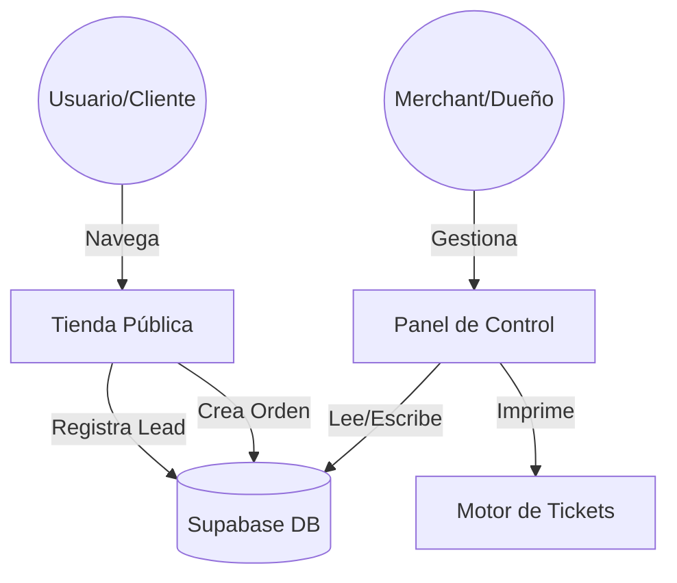

# Documentación Técnica: LinkVentas 🚀

LinkVentas es una plataforma SaaS de e-commerce de alto rendimiento diseñada para merchants modernos, enfocada en la velocidad de conversión y la simplicidad operativa.

## 🏗️ Arquitectura del Sistema

El proyecto utiliza un stack moderno de "Full-stack Serverless":

-   **Frontend**: Next.js 15+ (App Router) con React 19.
-   **Estilos**: Tailwind CSS v4 (Kinetic Design System).
-   **Base de Datos & Auth**: Supabase (PostgreSQL + RLS + GoTrue).
-   **Estado Global**: Zustand (Persistencia en LocalStorage para el carrito).
-   **Utilidades de UI**: Lucide React (Iconos), Sonner (Toasts), Framer Motion (Animaciones cinéticas).

### Flujo de Datos General



---

## 📊 Modelo de Datos (Esquema SQL)

La base de datos reside en Supabase y utiliza **Row Level Security (RLS)** para garantizar que cada Merchant solo acceda a su información.

### Tablas Principales

| Tabla | Propósito | Campos Clave |
| :--- | :--- | :--- |
| `profiles` | Configuración de la tienda | `slug`, `store_name`, `fomo_enabled`, `whatsapp_phone` |
| `products` | Catálogo de productos | `name`, `price`, `stock`, `brand`, `image_url` |
| `orders` | Ventas y pedidos | `customer_name`, `total_amount`, `payment_proof_url` |
| `store_leads` | Captura de clientes/leads | `customer_phone`, `metadata` |

> [!TIP]
> Puedes encontrar el script maestro de configuración en `seguridad_supabase.sql`.

---

## 🔥 Módulos Destacados

### 1. Motor FOMO (Stock Social)
Ubicación: `hooks/useFomo.ts` y `components/tienda/FomoBanner.tsx`

Genera una sensación de urgencia real mediante la fluctuación aleatoria de "personas viendo este producto", basada en los rangos (mín/máx) configurados por el merchant en su perfil.

### 2. Impresión de Tickets Térmicos
Ubicación: `lib/thermalUtils.ts` y `components/dashboard/ThermalReceipt.tsx`

Utiliza `html2canvas` para transformar un diseño HTML/CSS en una imagen PNG optimizada para impresoras térmicas de 58mm/80mm, eliminando colores conflictivos (`oklch`) automáticamente.

### 3. Sistema de Vanity URLs (Slugs)
Ubicación: `app/tienda/[id]/page.tsx`

Permite que una tienda sea accesible tanto por su UUID interno como por un nombre amigable (ej: `/tienda/mi-marca`). El sistema resuelve la identidad del merchant en el lado del servidor para maximizar el SEO.

---

## 🛠️ Herramientas de Mantenimiento

### LinkVentas Doctor
Un script de auditoría diseñado para identificar discrepancias entre el código y la base de datos de producción.

**Comando:**
```bash
npx tsx scripts/doctor.ts
```

**Funciones:**
-   Verifica conexión con Supabase.
-   Detecta columnas faltantes en las tablas principales.
-   Genera los comandos SQL automáticos para el parcheo de la DB.

---

## 🚀 Despliegue en Producción

1.  **Supabase**: Ejecutar `seguridad_supabase.sql` en el SQL Editor.
2.  **Vercel**: Conectar el repositorio y configurar las variables:
    -   `NEXT_PUBLIC_SUPABASE_URL`
    -   `NEXT_PUBLIC_SUPABASE_ANON_KEY`
3.  **Build**: `npm run build`

---

© 2026 LinkVentas - Arquitectura Técnica de Alto Rendimiento.
